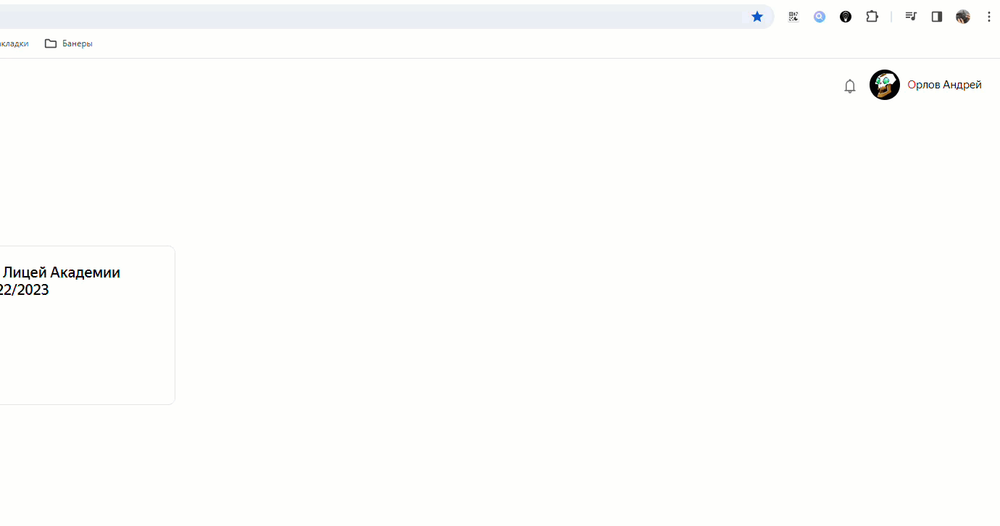

# DarkLMS v0.3
Преобразует Yandex LMS в тёмную тему

Чтобы включить тёмную тему LMS, выполните следующие шаги:

1. Распакуйте архив с кодом в удобное место на постоянную основу
2. Зайдите в chrome://extensions/ или browser://extensions/ (зависит от браузера)
3. Включите режим разработчика   
4. Нажмите "Загрузить распакованное расширение" и выберите папку с кодом   
5. В меню расширения переключите тему   
6. Готово!

Для того чтобы скачать расширение просто из магазина chrome, нужен аккаунт разработчика который стоит 5$ (~450р. на 26.01.24) 
Если есть желание увидеть расширение в магазине chrome, [вот ссылка на перевод](qiwi.com/n/VOKINTRU)
